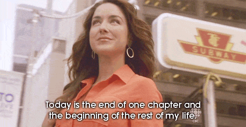
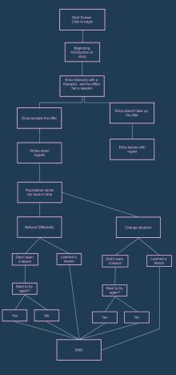

# Being Erica 

As humans, we all have regrets. In some way or another we’ve been through situations or experiences where we wish to go back time and fix things, respond differently, or behave in a certain way. Erica is human too and as everyone she has a list of millions, maybe trillions of regrets.

# Moral Story 

one must learn to be who they are and learn to resign with good grace what they are not!
Regret is a nature that we can’t overcome but we still can embrace and learn from with a hope for better experiences.

# Structure of the story 
